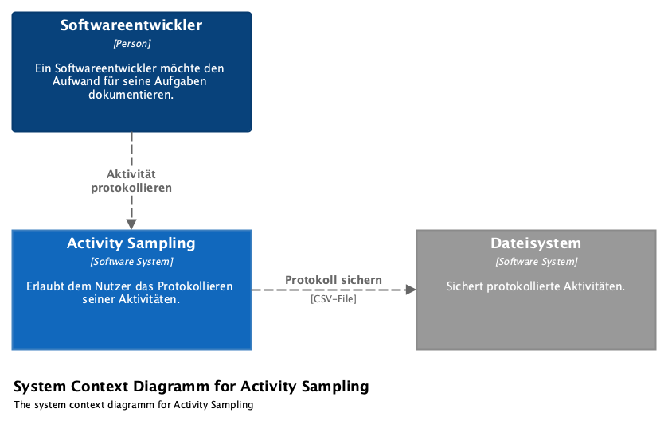

= Activity Sampling
:toc:

== System Context

== Features

=== Protokolliere Aktivität

* Frage Nutzer zyklisch nach aktueller Aktivität (Default: alle 20 min)
* Archiviere Zeitstempel, Intervall, Kunde, Projekt, Aktivität und optional Anmerkungen
* Sichere Protokoll als CSV-Datei

=== Parametriere Nachfrage

* Stelle Intervall der Nachfrage auf 15, 20 (Default), 30 oder 60 Minuten
* Hinterlege Vorname und Nachname
* Hinterlege Kapazität in Form von Stunden pro Woche (Default: 40)

=== Werte Protokoll aus

* Zeige Stundenzettel nach Zeitraum
* Summiere Stundenzettel nach Kunden
* Summiere Stundenzettel nach Projekten
* Summiere Stundenzettel nach Aufgaben
* Filtere Stundenzettel nach Kunde und Projekt
* Exportiere Stundenzettel als CSV-Datei

=== Erfasse verpasste Intervalle

* Merke Intervalle mit nicht dokumentierter Aktivität vor
* Dokumentiere vorgemerkte Aktivitäten

== Architektur

=== Containers

image::container-activity-sampling.png[Container-Diagramm für Activity Sampling]

=== Components

image::components-activity-sampling.png[Component-Diagramm für Activity Sampling]
